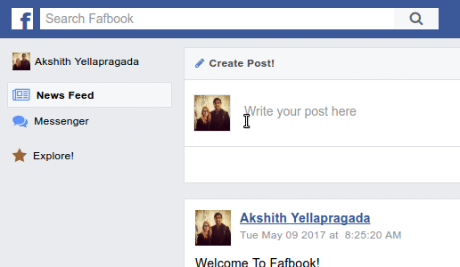

# README

Fafbook - Fafbook ain't Facebook.

[Fafbook][livesite]

[livesite]: http://www.fafbook.us/#/

Fafbook is a social networking site inspired by Facebook. It uses a Ruby on
Rails backend, a PostgreSQL database, and a React.js front end that uses Redux
for state management.

## Features & Implementation

### Profiles

Once a user makes an account, a profile is also created for them as well. The
profile is responsible for maintaining all of their extra information, such as
what goes into their `about me` component.

On a user page, all the posts for and made by, a user are displayed, but also
their information is displayed in their about me. Their friends and 9 latest
photos are also viewable in the side bar. The `friends` component also links to
their friends, and the `photos` component on click displays a modal with that
photo in a larger size. 

There are 3 separate tabs for a user, one to show their feed and a summary of their profile, one to show all their photos, and one to show all of their friends as well, each with links to open the friend page, or open the photo in a modal.

### Friends 

The only people who can interact with you in anyway are those people who you're
friends with. If a user is not friends with another user, to interact with them
they first need to send a friend request. Only if that request is approved are
they able to talk to them.

Friend requests are handled in a dropdown menu, in a `FriendRequestItem`
component that links to the User page, and has approve and deny buttons styled
like Facebook.

### Timelines and Feeds

On the backend, posts are stored in the table, with columns for `id`,
`author_id`, `receiver_id` and `body`. This way posts can be both self/status
posts, and posts that go to other members walls. 

Upon login and viewing the timeline, or feed for a particular user page, 
posts are pulled from the database and fed into the appropriate component to 
render those posts. 

On the front end, the UI is taken directly from Facebook to present a
profesional, clean, and comfortable look. To prevent server overload, infinite
scroll has been implemented so only 5 posts are ever loaded at one time, but is
seamlessly integrated so the User doesn't have lag from the database. 

### Posts and Comments 

To make both the `Timeline` and `Feed` component work, they needed `Post`
components to be fed into them, and in turn `Post` components also have
`Comment` components to handle responses. 

Posts can be deleted and edited, depending on the User relation to those posts,
via a dropdown menu. If a user is the one who wrote the post, they can edit or
delete it. On the otherhand if it's a post on their wall, they can only delete
it, mirroring how Facebook itself works.

Comments can be made on posts, and time is displayed using the Timeago library,
to make it easier for the reader to know when the comment was made. Both submit
and read are built into the post itself, for logical flow of action for the
user.

### Search

Search is a standard feature in any networking site, and using the pg_search
gem, it's possible to search for another user with both the first or last name.
It's implemented in a dropdown allowing for the user to search from any page,
without needed to leave the page they're on until they've found what they want
to search for. 

### Messaging

Messaging between users is required for any social networking site like
Facebook, where the entire point is to interact with other users. I added in
real time using the Pusher API. This system allows for a user to have up
multiple chats, to minimize chat windows, and to mark messages as read.

### Notifications 

Similar to messaging, notifications are now also done in real time, whenever a user writes a post, likes a post, or comments on a post. Comments on posts send out notifications to all other users who commented on that post.

## Future Directions for this project

In addition to what's been done already, I will continue to work on this
project.

### Improved CSS 

The last big step is to improve the css, by adding in responsiveness for different screen sizes, and optimizing the site for mobile. 

